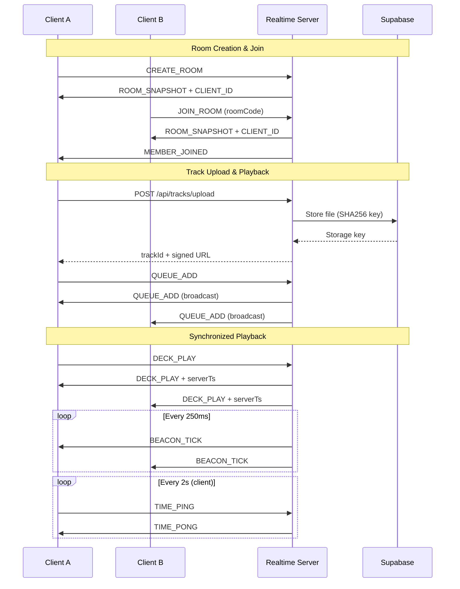
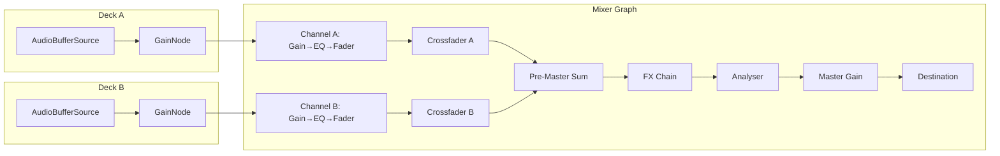
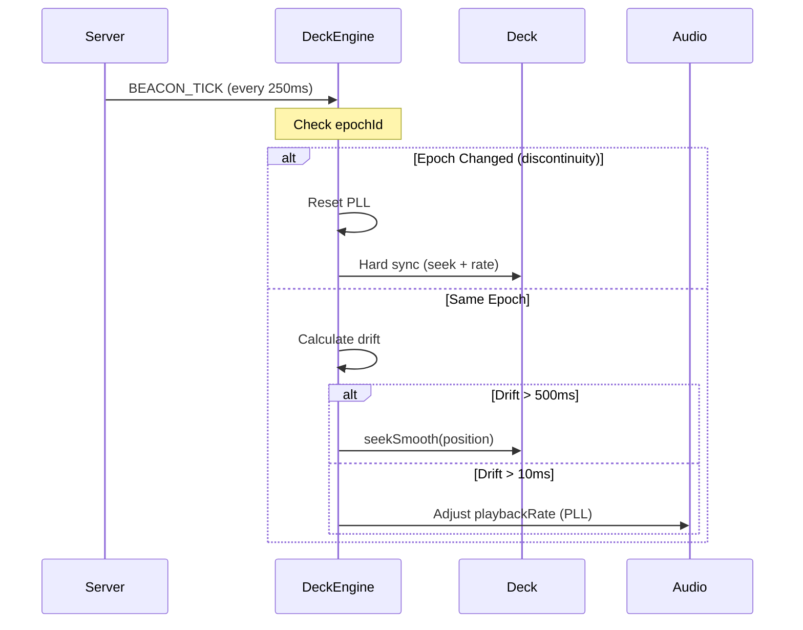
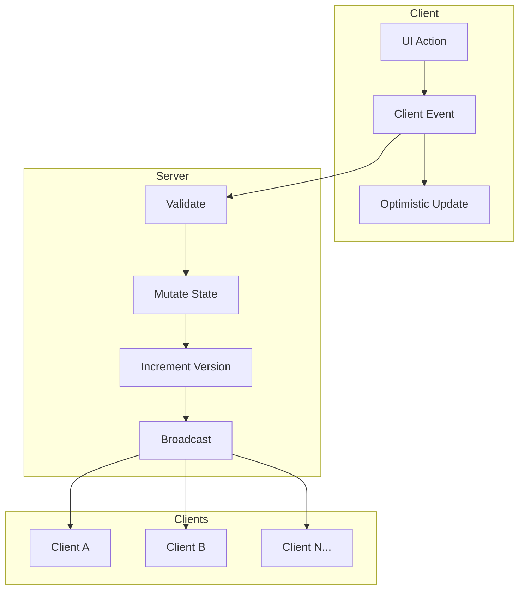
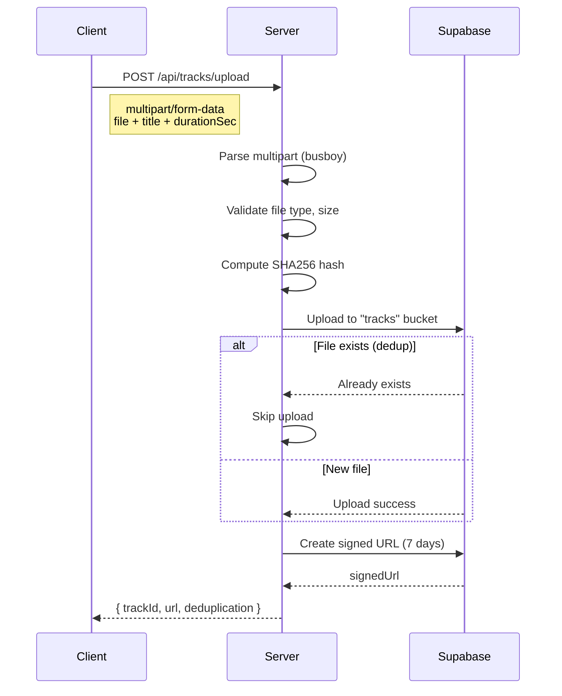

# puidBoard System Documentation

A comprehensive technical guide to the puidBoard Virtual DJ Rooms platform.

## Table of Contents

1. [Architecture Overview](#architecture-overview)
2. [Audio System](#audio-system)
3. [Realtime Sync System](#realtime-sync-system)
4. [State Management](#state-management)
5. [File Upload & Storage](#file-upload--storage)
6. [Deployment](#deployment)
7. [Key Files Reference](#key-files-reference)

---

## Architecture Overview

### Monorepo Structure

puidBoard uses a **pnpm workspace monorepo** managed by Turborepo:

```
puidBoard/
├── packages/
│   └── shared/          # Shared types, schemas, and utilities
├── apps/
│   ├── web/             # Next.js frontend (React)
│   └── realtime/        # Socket.IO backend server
├── pnpm-workspace.yaml  # Workspace configuration
├── turbo.json           # Turborepo pipeline config
└── package.json         # Root package with workspace scripts
```

### Package Overview

| Package | Purpose | Key Technologies |
|---------|---------|------------------|
| `@puid-board/shared` | Single source of truth for types, schemas, validators | Zod, TypeScript |
| `@puid-board/web` | Frontend application | Next.js 14, React 18, Socket.IO Client, Web Audio API |
| `@puid-board/realtime` | Realtime WebSocket server | Node.js, Socket.IO, Supabase |

### Tech Stack

- **Frontend**: Next.js 14 (App Router), React 18, TypeScript
- **Backend**: Node.js 20, Socket.IO 4.7, TypeScript (ESM)
- **State Validation**: Zod schemas for type-safe runtime validation
- **Storage**: Supabase Storage for audio files
- **Deployment**: Fly.io for both web and realtime services
- **Package Manager**: pnpm 9 with workspaces

### Communication Flow



---

## Audio System

### Web Audio API Architecture

The audio system uses the Web Audio API with a signal flow optimized for DJ mixing:



### Deck Class (`apps/web/src/audio/deck.ts`)

Each deck manages audio playback for a single channel:

```typescript
interface DeckState {
  deckId: "A" | "B";
  trackId: string | null;
  buffer: AudioBuffer | null;
  playState: "stopped" | "playing" | "paused" | "cued";
  playheadSec: number;           // Current position
  startTime: number | null;      // AudioContext.currentTime when started
  startOffset: number;           // Offset from track start
  cuePointSec: number;           // Cue point position
  durationSec: number;           // Track duration
  playbackRate: number;          // 0.5 to 2.0 (1.0 = normal)
  analysis: {
    waveform: WaveformData | null;
    bpm: number | null;
    status: "idle" | "analyzing" | "complete" | "error";
  };
}
```

Key methods:
- `loadTrack(trackId, url)` - Fetches, decodes, and caches audio
- `play()` - Creates AudioBufferSourceNode, starts playback
- `pause()` - Saves playhead, stops source
- `seek(positionSec)` - Jump to position (recreates source if playing)
- `setPlaybackRate(rate)` - Adjusts tempo (0.5x to 2.0x)
- `seekSmooth(positionSec, crossfadeMs)` - Crossfade seek for drift correction

### Mixer Graph (`apps/web/src/audio/mixerGraph.ts`)

The mixer graph is a singleton that creates and manages all audio routing:

```typescript
// Signal chain per channel:
// InputGain → EQ Low → EQ Mid → EQ High → Fader → Output

const EQ_FREQUENCIES = {
  low: 320,    // Low shelf filter
  mid: 1000,   // Peaking filter (Q=1.0)
  high: 3200,  // High shelf filter
};

// EQ range: -12dB to +12dB
// Crossfader uses equal-power law for smooth transitions
```

Key exports:
- `initMixerGraph()` - Initialize the full signal chain
- `getDeckInput(deckId)` - Get GainNode for deck connection
- `applyMixerState(mixer)` - Apply full mixer state from server
- `updateMixerParam(controlId, value)` - Update single parameter

### Audio Analysis

#### Waveform Generation (`apps/web/src/audio/analysis/waveformGenerator.ts`)

Generates visual waveform data using RMS amplitude:

```typescript
// 480 buckets by default (enough for smooth visualization)
// RMS (Root Mean Square) energy per bucket
// Normalized to 0-1 range
```

#### BPM Detection (`apps/web/src/audio/analysis/bpmDetector.ts`)

Uses a reliable onset detection approach:

1. **Extract mono audio** from first 30 seconds
2. **Low-pass filter** (IIR, alpha=0.1) to isolate bass/kick
3. **Energy envelope** with 50ms windows, 50% overlap
4. **Peak detection** with multiple threshold attempts (30%, 20%, 15%, 10%, 5%)
5. **Histogram analysis** to find dominant beat interval
6. **Octave correction** to stay within 60-180 BPM range

```typescript
// Adaptive threshold approach - tries strict first, then relaxes
const thresholds = [0.3, 0.2, 0.15, 0.1, 0.05];

// Each frame = 25ms (50ms window, 50% overlap)
const msPerBeat = dominantInterval * 25;
const bpm = 60000 / msPerBeat;
```

#### BPM Server Sync and Persistence

BPM detection happens client-side, but the result is persisted and synchronized via the server:

**Event Flow:**
```typescript
// 1. Client analyzes audio and detects BPM
Client -> detectBPM(buffer) -> analysis.bpm = 125

// 2. Client sends BPM to server
Client -> DECK_BPM_DETECTED(deckId: "A", bpm: 125) -> Server

// 3. Server stores and broadcasts
Server -> deck.detectedBpm = 125 -> broadcast to all clients

// 4. Server includes BPM in BEACON_TICK
Server -> BEACON_TICK { deckA: { detectedBpm: 125, ... } } -> All Clients

// 5. Display calculation
UI displays: detectedBpm × playbackRate
Example: 125 BPM × 1.08 = 135 BPM (shown to user)
```

**Key Features:**
- First client to analyze a track sets the server BPM
- Other clients see BPM immediately (before their own analysis completes)
- BPM persists across page refreshes via server state
- BEACON_TICK includes BPM for realtime synchronization
- Display BPM = `detectedBpm × playbackRate` (updates with tempo slider)

**Tempo Integration:**
- Tempo slider adjusts `playbackRate` (0.5x to 2.0x)
- Displayed BPM reflects current tempo: `Math.round(detectedBpm * playbackRate)`
- Sync button matches BPM by calculating: `targetBPM / sourceBPM = newRate`
- Jog wheel nudging temporarily adjusts rate but doesn't affect displayed BPM

### Local vs Server State Management

The audio system maintains two parallel state representations:

| Aspect | Local State | Server State |
|--------|-------------|--------------|
| Owner | Deck class | Room state |
| Purpose | Immediate audio control | Authoritative sync |
| Updates | Frame-accurate | Event-driven |
| Playhead | AudioContext timing | Epoch-based calculation |

**Key principle**: Local actions are optimistic. Server beacons confirm and sync all clients.

---

## Realtime Sync System

### Current Approach: BEACON_TICK with DeckEngine

The primary sync mechanism uses **250ms beacon broadcasts** with **epoch-based tracking** and **PLL drift correction**.



#### BEACON_TICK Structure

```typescript
interface BeaconTickEvent {
  type: "BEACON_TICK";
  roomId: string;
  payload: {
    serverTs: number;          // Server timestamp
    version: number;           // Room version
    deckA: DeckBeaconPayload;
    deckB: DeckBeaconPayload;
  };
}

interface DeckBeaconPayload {
  deckId: "A" | "B";
  epochId: string;             // Changes on discontinuity
  epochSeq: number;            // Increments each beacon while playing
  serverTs: number;
  playheadSec: number;         // Calculated position at serverTs
  playbackRate: number;
  playState: "stopped" | "playing" | "paused" | "cued";
}
```

### Why SYNC_TICK Drift Correction is Disabled

The legacy SYNC_TICK system (2s interval) is **deprecated** because:

1. **Multiple sync systems fighting** - SYNC_TICK snap corrections interfered with BEACON_TICK PLL corrections, causing oscillation
2. **Confusing tempo behavior** - SYNC_TICK would override user tempo changes from the fader
3. **Replaced by better approach** - BEACON_TICK (250ms) with PLL provides smoother, more accurate sync

The SYNC_TICK event still broadcasts for backwards compatibility but its drift correction code is commented out:

```typescript
// DISABLED: Old SYNC_TICK drift correction was fighting with BEACON_TICK PLL.
// BEACON_TICK (250ms) is now the sole sync mechanism.
// this.applyDriftCorrection("A", deckA);
// this.applyDriftCorrection("B", deckB);
```

### Clock Synchronization (TIME_PING/PONG)

Clients synchronize their clocks with the server using periodic pings:

```typescript
// Client sends TIME_PING every 2 seconds
socket.emit("TIME_PING", { type: "TIME_PING", t0: Date.now() });

// Server responds with TIME_PONG
socket.emit("TIME_PONG", { type: "TIME_PONG", t0: event.t0, serverTs: Date.now() });

// Client calculates offset:
const rtt = now - t0;
const oneWayMs = rtt / 2;
const offset = serverTs - (t0 + oneWayMs);
```

The clock sync module (`apps/web/src/audio/sync/clock.ts`):

- Maintains 7 samples with weighted averaging
- Rejects RTT spikes (> 2.5x average)
- Requires 5 samples for "reliable" status
- Provides `getServerTime()` for accurate server time estimation

### Epoch-Based Tracking

**Epochs** represent continuous playback periods. A new epoch is created on any discontinuity:

- Play/Pause/Stop
- Seek
- Tempo change
- Cue
- Track load

Each epoch has:
- `epochId` - UUID, changes on discontinuity
- `epochSeq` - Increments each beacon tick while playing
- `epochStartPlayheadSec` - Playhead when epoch started
- `epochStartTimeMs` - Server timestamp when epoch started

```typescript
// Server creates new epoch (apps/realtime/src/handlers/deck.ts)
function createNewEpoch(deck, serverTs, newPlayhead, newRate?) {
  deck.epochId = crypto.randomUUID();
  deck.epochSeq = 0;
  deck.epochStartPlayheadSec = newPlayhead;
  deck.epochStartTimeMs = serverTs;
  if (newRate !== undefined) {
    deck.playbackRate = newRate;
  }
}
```

### PLL (Phase-Locked Loop) Drift Correction

The PLL controller (`apps/web/src/audio/sync/pll.ts`) provides smooth drift correction:

```typescript
class PLLController {
  // Configuration
  static readonly MAX_CORRECTION_PERCENT = 2;    // ±2% max rate adjustment
  static readonly PROPORTIONAL_GAIN = 0.001;     // 0.1% per 100ms drift
  static readonly IGNORE_THRESHOLD_MS = 10;      // Ignore drift < 10ms
  static readonly SNAP_THRESHOLD_MS = 500;       // Snap if drift > 500ms
  static readonly FILTER_WINDOW_SIZE = 5;        // Median filter samples

  addMeasurement(driftMs: number): { correction: number; shouldSnap: boolean } {
    // Median filtering for noise rejection
    const medianDrift = this.getMedianDrift();

    if (Math.abs(medianDrift) > SNAP_THRESHOLD_MS) {
      return { correction: 1.0, shouldSnap: true };
    }

    if (Math.abs(medianDrift) < IGNORE_THRESHOLD_MS) {
      return { correction: 1.0, shouldSnap: false };
    }

    // Proportional correction
    // Positive drift (ahead) → slow down (factor < 1)
    // Negative drift (behind) → speed up (factor > 1)
    const correction = -medianDrift * PROPORTIONAL_GAIN;
    return { correction: 1.0 + clamp(correction, -0.02, 0.02), shouldSnap: false };
  }
}
```

### Latency Compensation

The DeckEngine applies latency compensation when calculating expected playhead:

```typescript
const oneWayLatencyMs = getAverageRtt() / 2;
const serverNow = getServerTime();
const elapsedSinceBeacon = (serverNow - beacon.serverTs) / 1000;

// Account for network latency
const latencyCompensatedElapsed = elapsedSinceBeacon + oneWayLatencyMs / 1000;
const expectedPlayhead = beacon.playheadSec + latencyCompensatedElapsed * beacon.playbackRate;
```

---

## State Management

### Server-Authoritative State Model

The server is the **single source of truth**. All state mutations flow through the server:



### Event-Driven Architecture

Events flow in a predictable pattern:

1. **Client sends event** with `clientSeq` for deduplication
2. **Server validates** using Zod schemas
3. **Server applies mutation** to room state
4. **Server assigns metadata** (`eventId`, `serverTs`, `version`)
5. **Server broadcasts** to all room members
6. **Clients update local state** from authoritative event

### Room State Schema

The complete room state (`packages/shared/src/state.ts`):

```typescript
interface RoomState {
  roomId: string;
  roomCode: string;              // 4-8 char join code
  version: number;               // Monotonically increasing
  createdAt: number;             // Server timestamp
  hostId: string;
  members: Member[];             // Connected clients
  queue: QueueItem[];            // Track queue
  deckA: DeckState;
  deckB: DeckState;
  mixer: MixerState;
  controlOwners: Record<string, ControlOwnership>;
}
```

### Deck State Tracking

```typescript
interface DeckState {
  deckId: "A" | "B";
  loadedTrackId: string | null;
  loadedQueueItemId: string | null;
  playState: "stopped" | "playing" | "paused" | "cued";
  serverStartTime: number | null;     // @deprecated - use epoch fields
  playheadSec: number;
  cuePointSec: number | null;
  durationSec: number | null;
  playbackRate: number;               // 0.5 to 2.0

  // Epoch tracking (current system)
  epochId: string;
  epochSeq: number;
  epochStartPlayheadSec: number;
  epochStartTimeMs: number;
}
```

### Event Types

Events are categorized by update pattern:

| Category | Events | Characteristics |
|----------|--------|-----------------|
| **Continuous** | `CURSOR_MOVE`, `MIXER_SET` | High-frequency, last-write-wins, throttled |
| **Discrete** | `DECK_LOAD`, `DECK_PLAY`, `QUEUE_ADD`, etc. | Must acknowledge, no dropping |

```typescript
// Throttle rates (packages/shared/src/index.ts)
const THROTTLE = {
  CURSOR_MS: 33,    // ~30 cursor updates/sec
  CONTROL_MS: 16,   // ~60 control updates/sec
  SYNC_TICK_MS: 2000,
};
```

---

## File Upload & Storage

### Supabase Storage Integration

Track files are stored in Supabase Storage using content-addressed storage:

```typescript
// Storage key = SHA256 hash of file content + extension
const fileHash = createHash("sha256").update(buffer).digest("hex");
const storageKey = `${fileHash}.mp3`;
```

Benefits:
- **Automatic deduplication** - Same file = same hash = same storage key
- **Immutable** - Content-addressed files can't be accidentally overwritten
- **Cache-friendly** - 1 year cache headers on URLs

### Track Upload Flow



### Signed URLs for Playback

All track URLs use **signed URLs** for reliable access:

```typescript
// 7 days expiry (604800 seconds) - long enough for any session
const { data } = await client.storage
  .from("tracks")
  .createSignedUrl(storageKey, 604800);

return data.signedUrl;
```

Why signed URLs:
- Works regardless of bucket public/private setting
- Prevents direct Supabase URL exposure
- Controlled expiration for security

### Storage Buckets Organization

| Bucket | Contents | Access |
|--------|----------|--------|
| `tracks` | Audio files (MP3, WAV, AIFF, FLAC) | Signed URLs only |

Supported formats:
- `audio/mpeg` (.mp3)
- `audio/wav` (.wav)
- `audio/aiff` (.aiff)
- `audio/flac` (.flac)

Max file size: **50 MB**

---

## Deployment

### Fly.io Configuration

Both services deploy to Fly.io in the `iad` (US East) region.

#### Web Frontend (`apps/web/fly.toml`)

```toml
app = "puidboard-web"
primary_region = "iad"

[env]
  PORT = "3000"
  NODE_ENV = "production"
  NEXT_PUBLIC_REALTIME_URL = "https://puidboard-realtime.fly.dev"

[http_service]
  internal_port = 3000
  force_https = true
  auto_stop_machines = false
  auto_start_machines = true
  min_machines_running = 1

[[vm]]
  size = "shared-cpu-1x"
  memory = "512mb"
```

#### Realtime Server (`apps/realtime/fly.toml`)

```toml
app = "puidboard-realtime"
primary_region = "iad"

[env]
  PORT = "3001"
  NODE_ENV = "production"

[http_service]
  internal_port = 3001
  force_https = true
  auto_stop_machines = false    # Keep alive for WebSockets
  auto_start_machines = true
  min_machines_running = 1

  [http_service.concurrency]
    type = "connections"
    hard_limit = 2500
    soft_limit = 2000

[[http_service.checks]]
  path = "/health"
  interval = "30s"
  timeout = "5s"

[[vm]]
  size = "shared-cpu-1x"
  memory = "512mb"
```

### Environment Variables

#### Required Secrets (set with `fly secrets set`)

**Realtime Server:**
```bash
fly secrets set CORS_ORIGINS="https://puidboard.com,https://www.puidboard.com"
fly secrets set SUPABASE_URL="https://xxx.supabase.co"
fly secrets set SUPABASE_SERVICE_KEY="eyJhbG..."
```

**Web Frontend:**
- `NEXT_PUBLIC_REALTIME_URL` - Set in fly.toml or as build arg

### Docker Build Process

Both services use multi-stage Docker builds from the monorepo root.

**Web Frontend Build:**
```dockerfile
# 1. Install production deps
# 2. Build shared package
# 3. Build Next.js app
# 4. Copy minimal artifacts to production image
```

**Realtime Server Build:**
```dockerfile
# Requires pre-built artifacts!
# Build locally first:
pnpm build --filter=@puid-board/realtime...

# Then build Docker image
docker build -f apps/realtime/Dockerfile .
```

### Health Checks

**Realtime Server** `/health` endpoint:
```json
{
  "status": "ok",
  "version": "0.1.0",
  "rooms": 5,
  "clients": 12,
  "persistence": { ... }
}
```

**Web Frontend** uses Next.js default health (responds to `/`).

---

## Key Files Reference

### Core Logic

| File | Purpose |
|------|---------|
| `packages/shared/src/state.ts` | Room state schema definitions |
| `packages/shared/src/events.ts` | All event schemas and types |
| `packages/shared/src/validators.ts` | Validation utilities |
| `apps/realtime/src/server.ts` | Server entry point |
| `apps/realtime/src/protocol/handlers.ts` | Socket.IO event registration |
| `apps/realtime/src/handlers/deck.ts` | Deck event handlers (play, pause, etc.) |
| `apps/realtime/src/timers/beacon.ts` | BEACON_TICK broadcaster |
| `apps/web/src/audio/deck.ts` | Audio deck class |
| `apps/web/src/audio/DeckEngine.ts` | Transport state manager |
| `apps/web/src/audio/mixerGraph.ts` | Audio routing |
| `apps/web/src/audio/sync/clock.ts` | Clock synchronization |
| `apps/web/src/audio/sync/pll.ts` | PLL drift correction |
| `apps/web/src/realtime/client.ts` | Socket.IO client wrapper |

### Configuration Files

| File | Purpose |
|------|---------|
| `pnpm-workspace.yaml` | Workspace packages |
| `turbo.json` | Build pipeline |
| `tsconfig.base.json` | Shared TypeScript config |
| `apps/web/fly.toml` | Web deployment config |
| `apps/realtime/fly.toml` | Realtime deployment config |
| `apps/web/Dockerfile` | Web Docker build |
| `apps/realtime/Dockerfile` | Realtime Docker build |

### Entry Points

- **Web App**: `apps/web/src/app/` (Next.js App Router)
- **Realtime Server**: `apps/realtime/src/server.ts`
- **Shared Types**: `packages/shared/src/index.ts`

---

## Debugging Tips

### Clock Sync Issues
Check `isClockReliable()` - needs 5+ samples. Look for RTT spikes in console logs.

### Audio Not Playing
Verify AudioContext state - must be `"running"`. User interaction required to resume.

### Drift/Sync Issues
1. Check `epochId` matches between beacons
2. Look for PLL correction logs (`[DeckEngine-X] PLL correction:`)
3. Verify clock sync is reliable

### State Not Updating
1. Check WebSocket connection status
2. Verify `roomId` matches in events
3. Look for validation errors in server logs

### Upload Failures
1. Check file size (max 50MB)
2. Verify MIME type is supported
3. Check Supabase credentials in server env

---

*Document generated for puidBoard v0.0.1*
